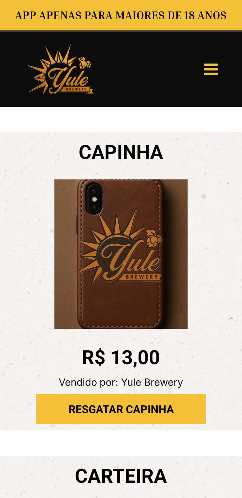
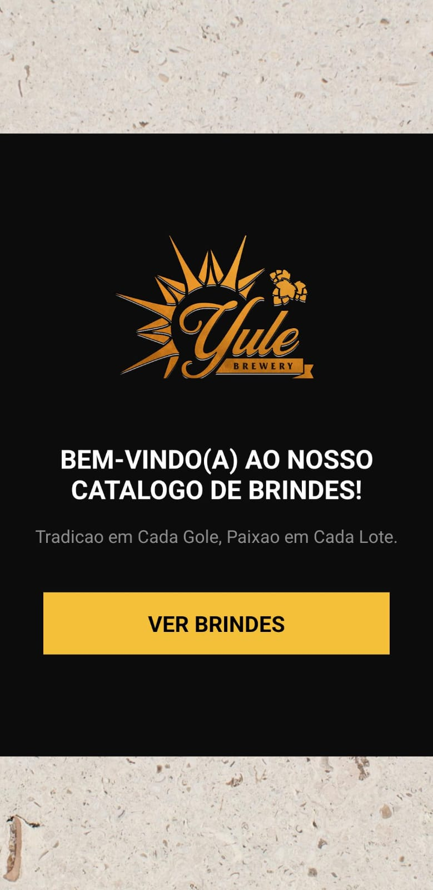
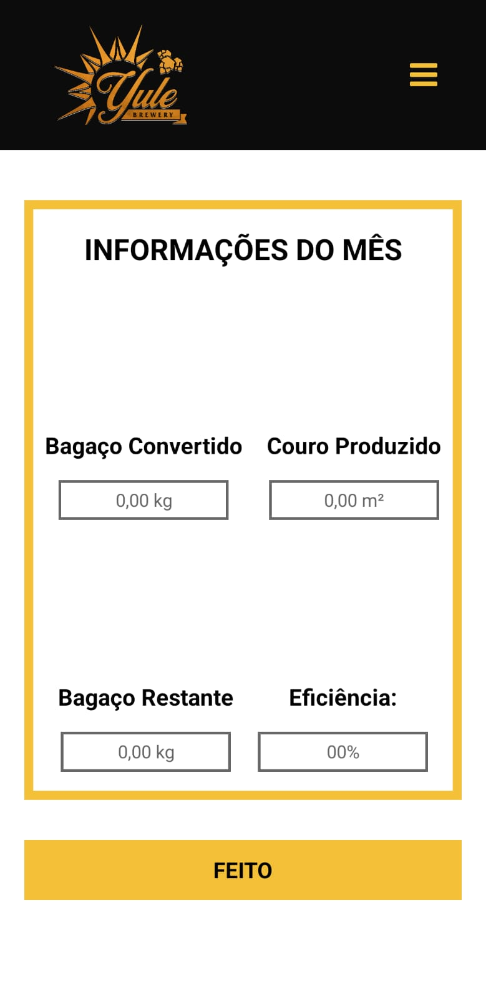

# 📱 Eco-Gift Catalog App - React Native (Expo)

This is a mobile app developed with **React Native** and **Expo Go**, designed to display a **catalog of eco-friendly gifts** made from spent malt grain leather. It allows users to redeem items, which are then tracked and registered in Firebase.

## 🖼️ Preview

## 🎁 Features

- 🛍️ Catalog of sustainable gifts
- 📅 Tracks redemptions by month
- 📥 Register each redemption in Firebase
- 📈 Triggers backend calculations

## ⚡ Firebase Integration

- Saves gift redemptions to Firestore
- Categorizes redemptions by month
- Helps buld monthly analytics for the dashboard (https://yule-cervejaria-chart.vercel.app/)

## 📦 Tech Stack

- React Native (Expo Go)
- Firebase Firestores
- TypeScript Execute
- AsyncStorage

## 🌿 Sustainability Focus
This app enables users to engage with a sustainable catalog and helps companies measure the impact of repurposing brewing byproducts into leather-based gifts.
